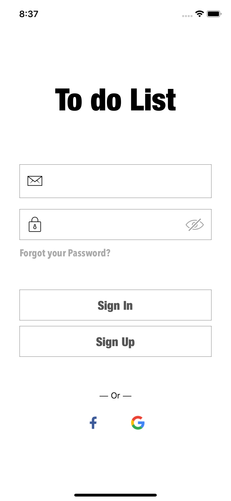
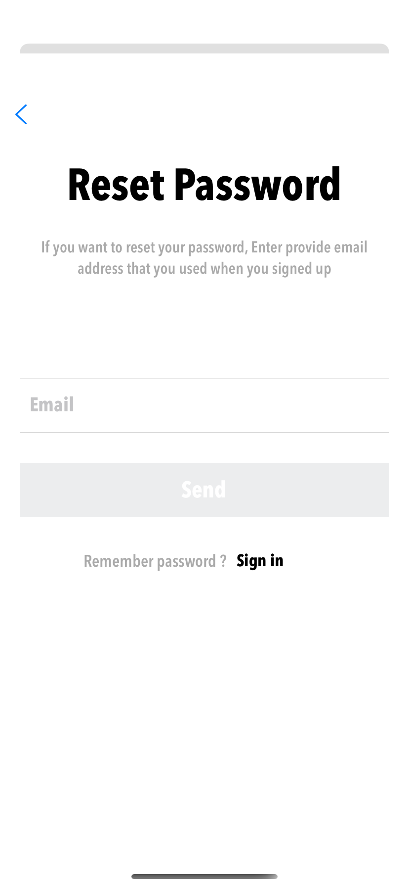
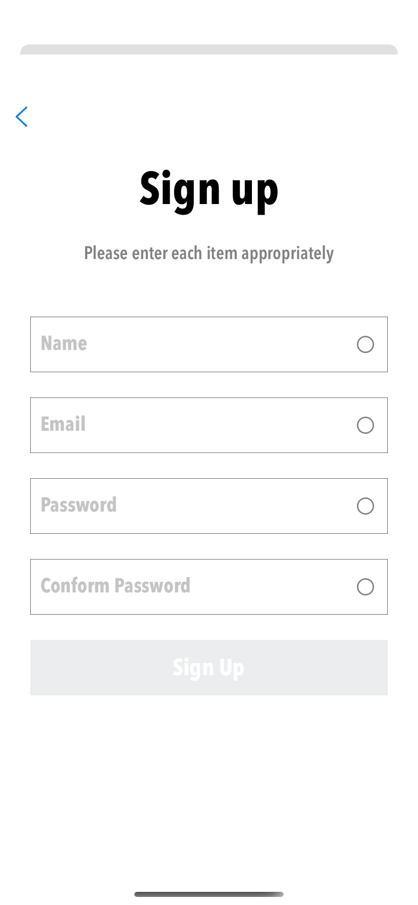
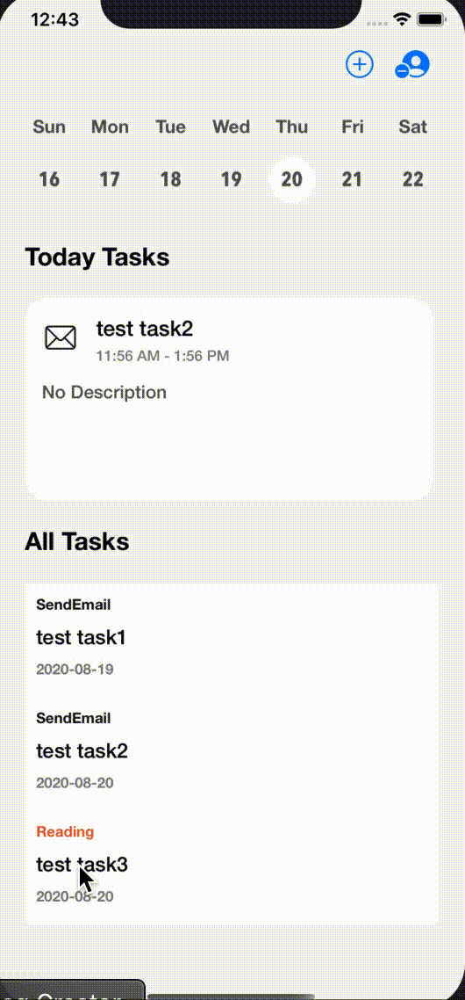
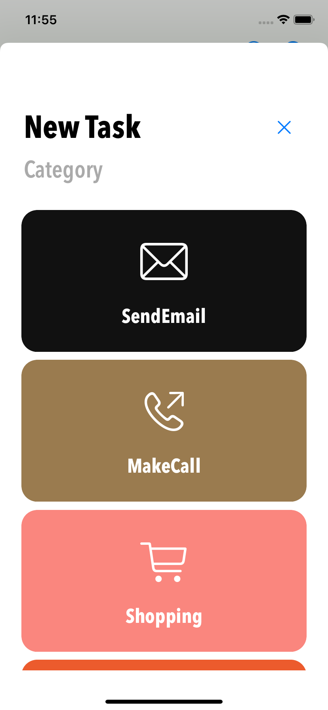
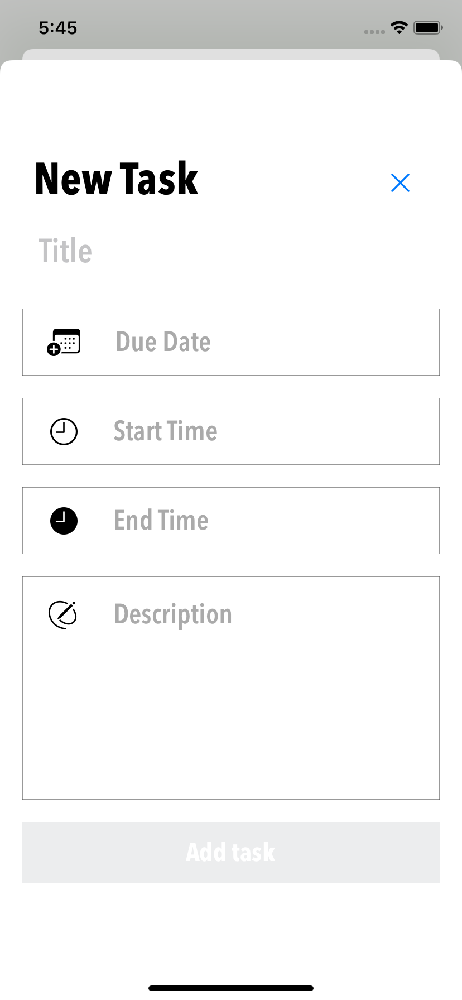
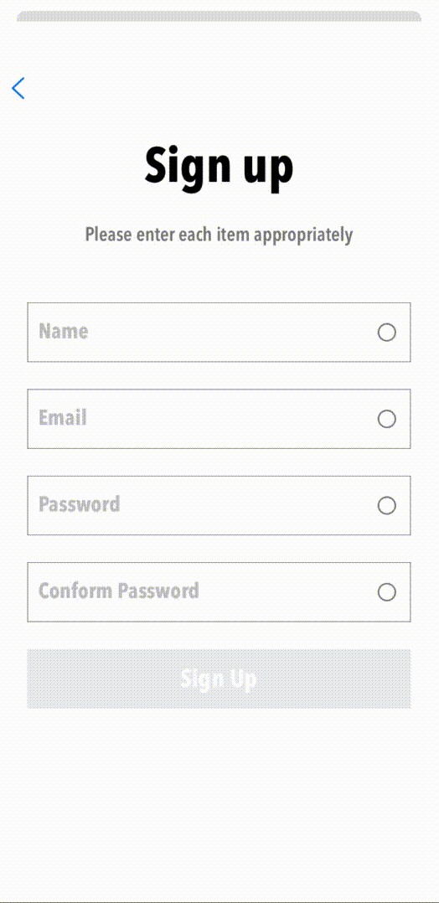
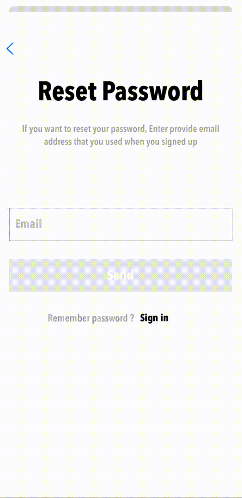
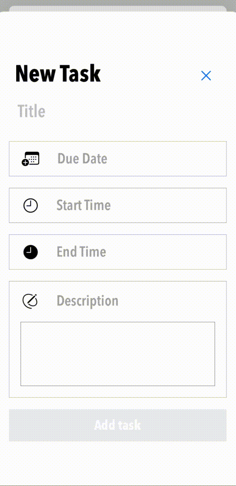

# __ToDoList__

인원 : 1명   

기간 : 2020.04.16 - 2020.05.07   

## __스크린샷__

  

  

## __Library__

- [FSCalendar](https://github.com/WenchaoD/FSCalendar)
- [ObjectMapper](https://github.com/tristanhimmelman/ObjectMapper)
- [RxSwift](https://github.com/ReactiveX/RxSwift)
- [Then](https://github.com/devxoul/Then)
- [SCLAlertView](https://github.com/vikmeup/SCLAlertView-Swift)
- [SnapKit](https://github.com/SnapKit/SnapKit)

## __SDK__

- FBSDKLoginKit
- Firebase Auth
- Firebase Database
- GoogleSignIn

## __Feature__

- RxSwift + MVVM

- Social Login

- Validate

  

- Without storyboard

## __Requirement__

- iOS 13
    - Using SFSymbols
- Swift 5
    - Using Result Type

## __Project Structure__

+ __Service__

    + TaskService : Firebase Database를 이용하여 Task 추가, 완료, 삭제, fetch   

        ~~~swift
        protocol TaskServiceProtocol {
            func search(about target: Task, key completion: @escaping (String?) -> ())

            func add(_ targetDictionary: [String:Any]) -> Observable<ServiceResult>

            func complete(_ target: Task) -> Observable<Void>

            func delete(_ target: Task) -> Observable<Void>

            func fetch(_ target: Task) -> Observable<Void>
        }
        ~~~

        &emsp;search는 Task 완료, 삭제를 위해 Firebase Database에서 해당 Task의 Key를 검색하는 함수입니다.

    + AuthService : 회원가입, 로그인, 로그아웃, 비밀번호 재설정

        &emsp;로그인 방식은 Email/Password, Facebook, Google 세 종류가 있습니다.

        ~~~swift
        protocol AuthServiceProtocol {
            func signUp(with email: String, _ name: String, _ password: String, _ conformPassword: String) -> Observable<ServiceResult>

            func signInWithEmail(email: String, password: String) -> Observable<ServiceResult>

            func signInWithFacebook(accessToken: AccessToken) -> Observable<ServiceResult>

            func signInWithGoogle(authentication: GIDAuthentication) -> Observable<ServiceResult>

            func sendPasswordResetEmail(email: String) -> Observable<ServiceResult>

            func signOut(providerData: UserInfo) -> Observable<ServiceResult>
        }
        ~~~

+ __Model__   

    &emsp;User, Task 모델은 ObjectMapper를 이용해서 JSON을 Mapping 했습니다.

    + User

        ~~~swift
        class User: Mappable {
            var name: String?
            var uid: String?

            required init?(map: Map) {
                ...
            }

            func mapping(map: Map) {
                name <- map["name"]
                uid <- map["uid]
            }
        }
        ~~~

    + Task

        ~~~swift
        class Task: Mappable {
            var title: String?
            var category: String?
            var date: String?
            var description: String?
            var startTime: String?
            var endTime: String?
            var isCompleted: Bool?

            required init?(map: Map) {
                ...
            }

            func mapping(map: Map) {
                title <- map["title"]
                category <- map["category"]
                date <- map["date"]
                description <- map["description"]
                startTime <- map["startTime"]
                endTime <- map["endTime"]
                isCompleted <- map["complete"]
            }
        }
        ~~~
    + Category   

        &emsp;enum 형식의 Category 종류

+ __View__

    + Cell

    + View Controller   

+ __View Model__   

    &emsp;View Model은 input, output, dependency의 프로토콜 구조로 구성했습니다.

    ~~~swift
    protocol ViewModel {
        associatedtype Input
        associatedtype Output
        associatedtype Dependency

        var input: Input { get }
        var output: Output { get }
        var dependency: Dependency { get }
    }
    ~~~

+ __Util__

    + Extension

        + Rx   

            + UIViewController+Rx
            
                UIViewController의 life cycle event(viewDidLoad, viewDidAppear)를 ControlEvent type으로 사용했습니다.

                ~~~swift
                import RxSwift
                import RxCocoa

                extension Reactive where Base: UIViewController {
                    var viewDidLoad: ControlEvent<Void> {
                        let source = self.methodInvoked(#selector(Base.viewDidLoad)).map { _ in }
                        return ControlEvent(events: source)
                    }
                    
                    var viewDidAppear: ControlEvent<Void> {
                        let source = self.methodInvoked(#selector(Base.viewDidAppear)).map { _ in }
                        return ControlEvent(events: source)
                    }
                }
                ~~~

            + FacebookDelegateProxy, GoogleDelegateProxy

                Facebook, Google 로그인 후 제공되는 provider data의 display name 정보를 Firebase Database에 저장하기 위한 Delegate를 Reactive한 방식으로 사용하기 위한 Delegate Proxy 입니다.

                ~~~swift
                import FBSDKLoginKit
                import RxSwift
                import RxCocoa

                class FacebookDelegateProxy: DelegateProxy<FBLoginButton, LoginButtonDelegate>, DelegateProxyType, LoginButtonDelegate {
                    let subject = PublishSubject<(LoginManagerLoginResult?, Error?)>()
                    
                    static func registerKnownImplementations() {
                        self.register { button -> FacebookDelegateProxy in
                            FacebookDelegateProxy(parentObject: button, delegateProxy: FacebookDelegateProxy.self)
                        }
                    }
                    
                    static func currentDelegate(for object: FBLoginButton) -> LoginButtonDelegate? {
                        return object.delegate
                    }
                    
                    static func setCurrentDelegate(_ delegate: LoginButtonDelegate?, to object: FBLoginButton) {
                        object.delegate = delegate
                    }
                    
                    func loginButton(_ loginButton: FBLoginButton, didCompleteWith result: LoginManagerLoginResult?, error: Error?) {
                        subject.onNext((result, error))
                    }
                    
                    func loginButtonDidLogOut(_ loginButton: FBLoginButton) {
                        ...
                    }
                }

                extension Reactive where Base: FBLoginButton {
                    var delegate: FacebookDelegateProxy {
                        return FacebookDelegateProxy.proxy(for: base)
                    }
                    
                    var result: Observable<(LoginManagerLoginResult?, Error?)> {
                        return delegate.subject.asObservable()
                    }
                }
                ~~~

                `SignInViewController` 에서 사용

                ~~~swift
                facebookButton.rx.result
                    .subscribe(onNext: { result, error in
                        if let error = error as NSError? {
                            AuthErrorCode.show(error)
                        } else if let token = result?.token {
                            self.viewModel.input.facebookLogin.accept(token)
                        }
                    })
                ~~~

        + Import   

            &emsp;SnapKit, Then은 한 번 import 시 프로젝트 전체에서 사용할 수 있기 때문에 import 파일을 생성해놓았습니다.

        + Constant   

            &emsp;프로젝트 내에서 자주 쓰이는 상수들을 정의해놓았습니다.

        + SCLAlertView  

            &emsp;Firebase/Auth에서 발생하는 error를 SCLAlertView를 이용해 사용자에게 알릴 수 있도록 구현했습니다.

            ~~~swift
            extension AuthErrorCode {
                static func show(_ error: NSError) {
                    switch AuthErrorCode(rawValue: error.code) {
                    case .networkError :
                        SCLAlert.present(title: "ERROR", subTitle: "Please check your network connection", style: .error)

                    case .userNotFound :
                        SCLAlert.present(title: "ERROR", subTitle: "Your account could not be found.", style: .error)

                            .
                            .
                            .
                    }
                }
            }

            extension GIDSignInErrorCode {
                static func show(_ error: NSError) {
                    switch GIDSignInErrorCode(rawValue: error.code) {
                    case .unknown:
                        SCLAlert.present(title: "ERROR", subTitle: "Unknown Error has been occured", style: .error)
                    
                    case .keychain:
                        SCLAlert.present(title: "ERROR", subTitle: "Keychain Error", style: .error)

                            .
                            .
                            .
                    }
                }
            }
            ~~~

        + UIKit

        + Foundation

        + FSCalendar

    
    + KeyboardObserverProtocol   

        protocol을 채택한 View Controller에서 keyboardWillShowNotification과 keyboardWillHideNotification에 대한 Observer를 생성하여 사용자가 텍스트 입력 시 키보드에 의해 View 가 가려지는 현상을 방지할 수 있도록 구현했습니다.

        ~~~swift
        protocol KeyboardObserverProtocol {
            func register(for object: AnyObject)
            func register()
            func remove()
        }
        ~~~

        register(for object: AnyObject)는 특정 Object만 Observer의 대상으로 지정하기 위해 구현했습니다.
        